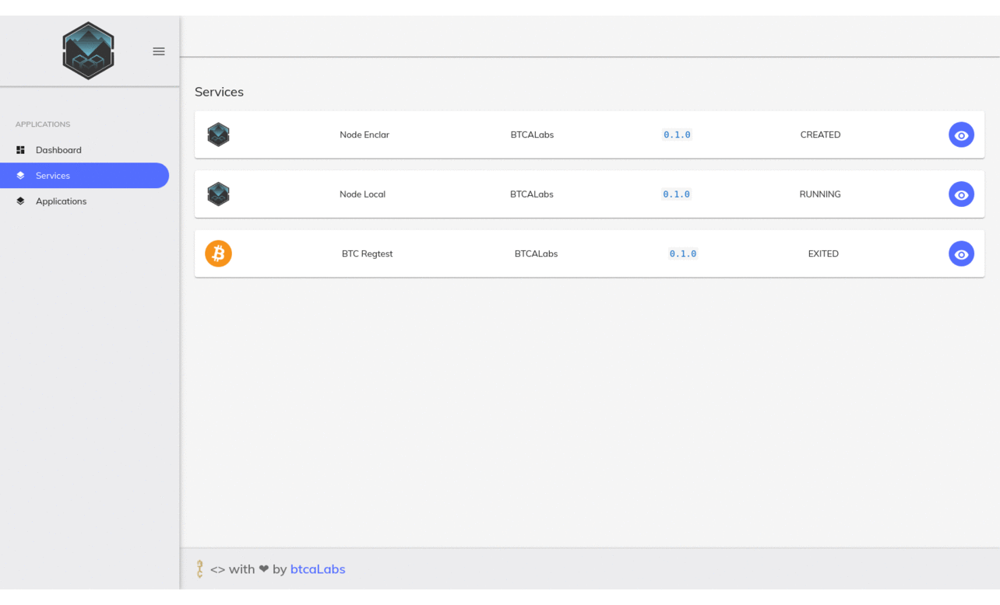

# NodeCenter


**NodeCenter is a *blockchain* node manager made by humans for humans**



**Uses a web frontend built with Angular 8 and Docker images marshalled with
more information to easily deploy with a GUI nodes in one click for several
*blockchain* platforms.**

## Goal
It aims to solve the hassle to setup a node and operate a node, so that all
management operations can be easily done via a user friendly web interface.

This web interface must be able to manage all operations in a node and also
provide the endpoints for the APIs that every node provides so it can be used
by dApps or other *DLT*/*blockchain* applications.


## Running the app

Try it out now in just **3 steps**

### 1. Prerequisites
#### Docker
You will need [Docker][docker] installed on your machine.

> Visit [Docker Community Engine (CE)][docker-ce]'s
> [installation documentation][get-docker] for more information about
> installing [Docker CE][docker-ce] in your device.


#### Docker Compose

You will also need [Docker Compose][docker-compose] to easily launch all the
application components.

> Visit the [documentation][get-docker-compose] for more information about
> installing [Docker Compose][docker-compose] in your machine.

### 2. Clone this repository
Once you have a [Docker][docker] engine running in your machine, start by
cloning this repository and `cd` into it

```sh
git clone https://gitlab.com/nodecenter/app
cd app
```

### 3. Run it
Now you can use [Docker Compose][docker-compose] to start running the
NodeCenter application right now

```sh
docker-compose up
```

> If you want to run it in the background so you can continue using the
> same shell, add `-d` to the command:
> ```sh
> docker-compose up -d
> ```


### 4. Enjoy the experience!
Congratulations! The application just started, visit

**http://localhost:8080**

and take a look 👀.


## Notes
### *Ethereum* Local Node:

This node launches a local development *Ethereum blockchain* with *PoA*
*Clique* consensus.

Also preloads an address with a big amount of *ethers*.

The private key for this account is:

```
132f23f1eb8ec71f3652df504a334af4c114bee80fc78324239cd3464561f610
```

### Voting component
To see the voting process and proceed to vote, you need to expose an extra
RPC API to your *Go Ethereum Clique PoA* node.

#### Workaround
Run this commands on a shell with a running node to enable it:

```sh
docker stop Node_Local
docker rm Node_Local
docker run -p 8545:8545 -p 30303:30303/tcp -p 30303:30303/udp --name Node_Local blockvalley/local --rpc --rpcaddr 0.0.0.0 --rpcapi eth,web3,net,clique
```

> Replace `Node_Local` in those commands by your container name if the node
> to enable the API for is a local node.

[docker]: https://www.docker.com/
[docker-ce]: https://docs.docker.com/install/
[get-docker]: https://docs.docker.com/install/#supported-platforms
[docker-compose]: https://docs.docker.com/compose/
[get-docker-compose]: https://docs.docker.com/compose/install/
